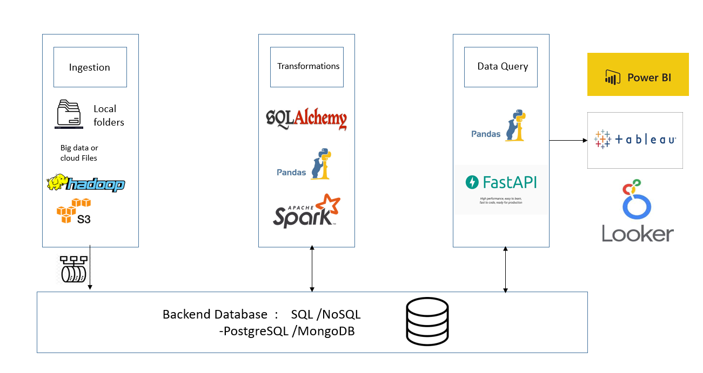
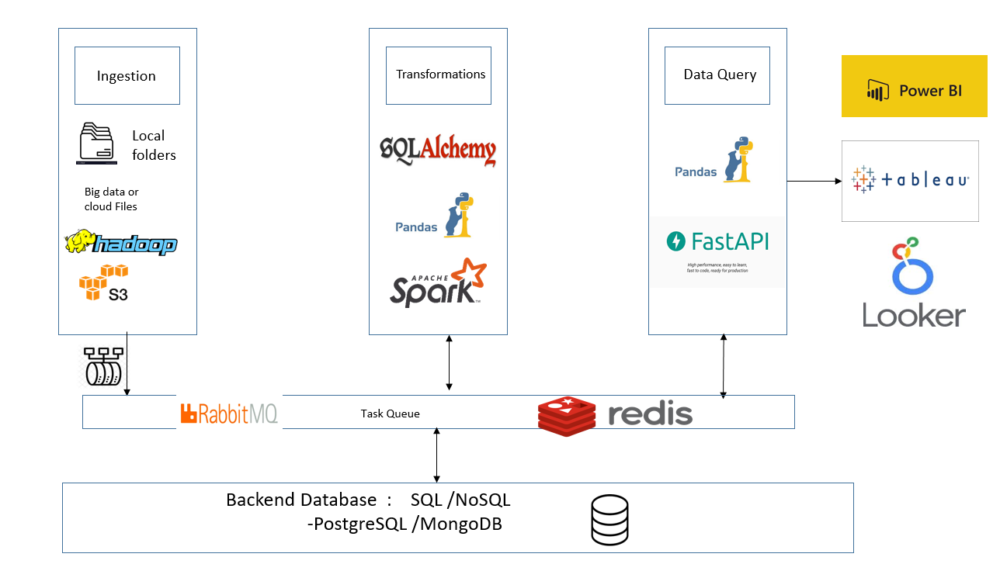
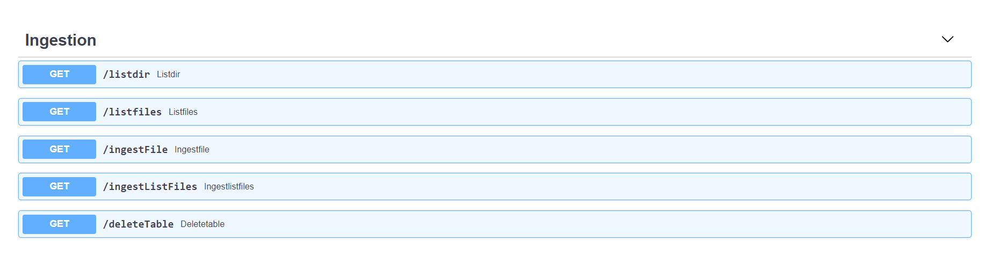
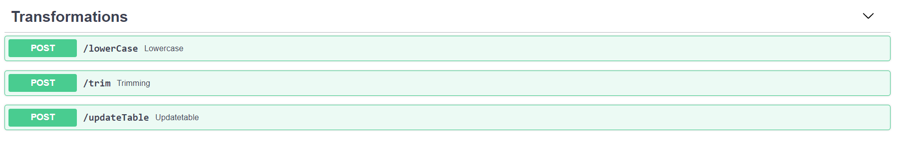
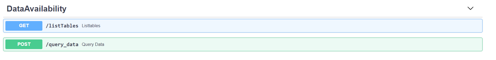

## Data pipeline
- Hackathon Solution

- The Application wasw deployed in this location :

        https://agy47b.deta.dev/docs

## Small POC implementation of Data Pipeline with REST API

### Every stage of Pipeline was controlled through REST API

### Following stages are available as of now , (more can be added in future)

- Ingestion

- Transformations

- Data availability

## Architecture 

##  Design / Architecture (synchronous)

## Async Architecture (Multiprocessing)

## Ingestion 

Following rest APIs are available

ingest single file or multiple files parallely

## Transformations

## Data Availability

Note : 

   - Database Connection was established through Sqlalchemy
   - so this can be converted to different Backend database
        - Sqlite
        - Postgres SQL
        - MongoDB (through motor ,pymongo ORMs)
    - Code can be reused for different backend database        
        